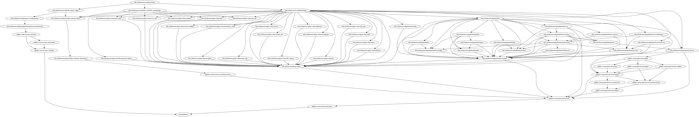

# godepq

A utility for inspecting go import trees

```
Usage of godepq:
  -all-paths=false: whether to include all paths in the result
  -from="": root package
  -ignore="": regular expression for packages to ignore
  -include-stdlib=false: whether to include go standard library imports
  -include-tests=false: whether to include test imports
  -o="list": {list: print path(s), dot: export dot graph}
  -to="": target package for querying dependency paths
```

## Installation:

```
$ go install k8s.io/contrib/godepq
```

## Examples:

List the packages imported:
```
$ godepq -from k8s.io/contrib/godepq
Packages:
  k8s.io/contrib/godepq
  flag
  github.com/timstclair/godepq/pkg
  fmt
  os
  errors
  go/build
  regexp
  log
```

Find a path between two packages:
```
$ godepq -from k8s.io/kubernetes/pkg/kubelet -to k8s.io/kubernetes/pkg/master
No path found from "k8s.io/kubernetes/pkg/kubelet" to "k8s.io/kubernetes/pkg/master"
$ godepq -from k8s.io/kubernetes/pkg/kubelet -to k8s.io/kubernetes/pkg/credentialprovider
Packages:
  k8s.io/kubernetes/pkg/kubelet
  k8s.io/kubernetes/pkg/kubelet/rkt
  k8s.io/kubernetes/pkg/credentialprovider
```

Track down how a test package is being pulled into a production binary:
```
$ godepq -from k8s.io/kubernetes/cmd/hyperkube -to net/http/httptest -all-paths -o dot | dot -Tpng -o httptest.png
```


