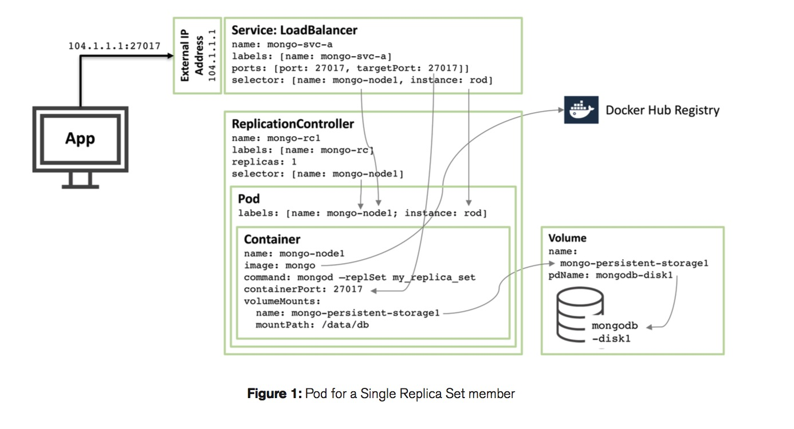
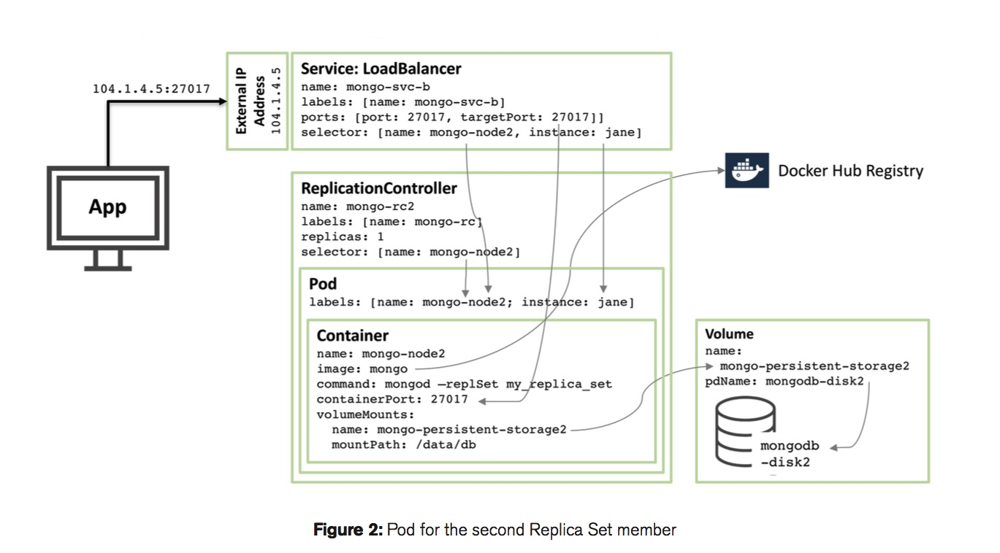
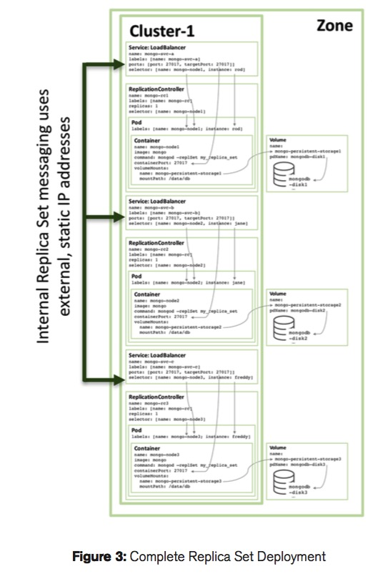

Deploy MongoDB with Kubernets and Ceph
================================================================

#### MongoDB replica set: A Single member
---------------------------------------------------------------

##### Mongod RS and Kubernetes RC
A Single Replica Set member in kubernetes and GCE(Google Computing Engine) look like this:



In our environment, we choose Ceph RBD as our block storage. 

A single rs defined with kubernetes and ceph rbd: 

```yaml
#	Copyright 2016, Google, Inc.
# Licensed under the Apache License, Version 2.0 (the "License");
# you may not use this file except in compliance with the License.
# You may obtain a copy of the License at
#
#    http:#www.apache.org/licenses/LICENSE-2.0
#
# Unless required by applicable law or agreed to in writing, software
# distributed under the License is distributed on an "AS IS" BASIS,
# WITHOUT WARRANTIES OR CONDITIONS OF ANY KIND, either express or implied.
# See the License for the specific language governing permissions and
# limitations under the License.

kind: ReplicationController
apiVersion: v1
metadata:
  name: mongo-1
spec:
  replicas: 1
  selector:
    name: mongo-node-1
    role: mongo
    environment: test
  template:
    spec:
      containers:
        - name: mongo-node-1
          image: mongo:latest
          command:
            - mongod
            - "--replSet"
            - rs0
            - "--smallfiles"
            - "--noprealloc"
          ports:
            - containerPort: 27017
          volumeMounts:
          - name: mongo-node-1
            mountPath: /data/db
      volumes:
      - name: mongo-node-1
        rbd: 
          monitors:
            - "172.21.1.11:6789"
          pool: rbd
          image: mongo-node-1
          secretRef:
            name: ceph-secret
          fsType: ext4
          readOnly: false
    metadata:
      labels:
        name: mongo-node-1
        role: mongo
        environment: test
```

Figure 1 illustrates one of these pods and the assiociated Replication Controller and service:

* Starting at the core there is a single container namede mongo-node-1,includes an image call mongo. mongo images is offercial version hosted on [Docker Hub](https://hub.docker.com/_/mongo/). The container exposes port 27017 within the cluster.

* The rc(ReplicationController) mongo-node-1 use ceph rbd to store persistent data on disk. The path "/data/db" with be mapped on mongo-node-1(rbd image) witch filesystem is ext4. when mongodb rs rescheduled, block device mongo-node-1 will be remount by the new pod.

* The lb(LoadBalancer) service name mongo-svc-1 expose an IP Address to the outside world together with the port of 27017 which is mapped to the same port number in the container. The serivce identifies the correct pod using a selector that matches the pods' labels.


##### Use Kubernetes service object as a lb

The lb mongo-svc-1 can be defined in a yaml file:

```yaml
#	Copyright 2016, Google, Inc.
# Licensed under the Apache License, Version 2.0 (the "License");
# you may not use this file except in compliance with the License.
# You may obtain a copy of the License at
#
#    http:#www.apache.org/licenses/LICENSE-2.0
#
# Unless required by applicable law or agreed to in writing, software
# distributed under the License is distributed on an "AS IS" BASIS,
# WITHOUT WARRANTIES OR CONDITIONS OF ANY KIND, either express or implied.
# See the License for the specific language governing permissions and
# limitations under the License.

apiVersion: v1
kind: Service
metadata:
  labels:
    name: mongo-1
  name: mongo-1
spec:
  ports:
    - port: 27017
      targetPort: 27017
  selector:
    name: mongo-node-1
```

##### Create RBD device and use it

Before you use rbd command, you need to install ceph on your system.


Create a RBD Image and Mount it:

```bash
rbd create mongo-node-1 -s 10240

rbd map mongo-node-1

rbd showmapped

id pool image        snap device    
0  rbd  mongo-node-1 -    /dev/rbd0

```

Format the block device with ext4 filesystem

```bash
mkfs.ext4 /dev/rbd0
```

Umount the block device

```bash
rbd unmap /dev/rbd0
```

##### Create RC and Service to setup a MongoDB Replica Set

```bash
kubectl create -f mongo-rc-rbd-1.yaml
kubectl create -f mongo-svc-1.yaml
```

#### MongoDB replica set: Three members 
---------------------------------------------------------------

Figure 2 shows the configuration for a second member of the replica set. 




---------------------------------------------------------------

Figure 3 shows the full target configuration



##### Create three members with kubernetes rc and persistent-disk ceph rbd

```bash
kubectl create -f mongo-rc-rbd-1.yaml
kubectl create -f mongo-rc-rbd-2.yaml
kubectl create -f mongo-rc-rbd-3.yaml
```

##### Create three service for the three members with kubernetes svc

You can access every mongo node use its service:

```bash
kubectl create -f mongo-svc-1.yaml
kubectl create -f mongo-svc-2.yaml
kubectl create -f mongo-svc-3.yaml
```

But we'd like a Single entrypoint to access mongodb replica set sevice:

```bash
kubectl creat -f mongo-svc.yaml
```


#### Initailize the MongoDB Replicat Set
---------------------------------------------------------------

Get the service portal address:

```bassh
kubectl get svc mongo-svc

NAME        LABELS           SELECTOR                      IP(S)          PORT(S)
mongo-svc   name=mongo-svc   environment=test,role=mongo   192.168.3.62   27017/TCP

kubectl describe svc mongo-svc

Name:			mongo-svc
Namespace:		default
Labels:			name=mongo-svc
Selector:		environment=test,role=mongo
Type:			NodePort
IP:			192.168.3.62
Port:			<unnamed>	27017/TCP
NodePort:		<unnamed>	32017/TCP
Endpoints:		172.16.44.2:27017,172.16.7.2:27017,172.16.7.3:27017
Session Affinity:	None
No events.
```


```bash
mongo --host 172.16.44.2
```

```javascript
config = {
    "_id" : "rs0",
    "members" : [
                  {
                     "_id" : 0,
                     "host" : "mongo-1.default.svc:27017",
                     priority: 4
                  },
                  {
                     "_id" : 5,
                     "host" : "mongo-2.default.svc:27017",
                     priority: 3
                  },
                  {
                     "_id" : 3,
                     "host" : "mongo-3.default.svc:27017",
                     priority: 3
                  }
     ]
}
```

```bash
rs.reconfig(config, {"force": true})
rs.status()
```

You also can add rs node by add and remove command

```bash
rs.add("172.16.7.3")
rs.remove("172.16.7.3:27017")
```


#### Reference

* A MongoDB White Paper: <*Enabling Microservices Containers & Orchestration Explained March 2016*>

* Thanks to Sandeep Dinesh(@SandeepDinesh) and [his article](https://medium.com/google-cloud/mongodb-replica-sets-with-kubernetes-d96606bd9474#.6sz1d6tvc)
